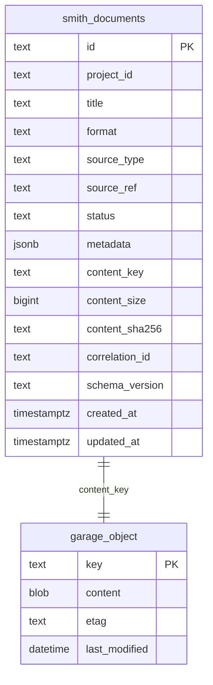
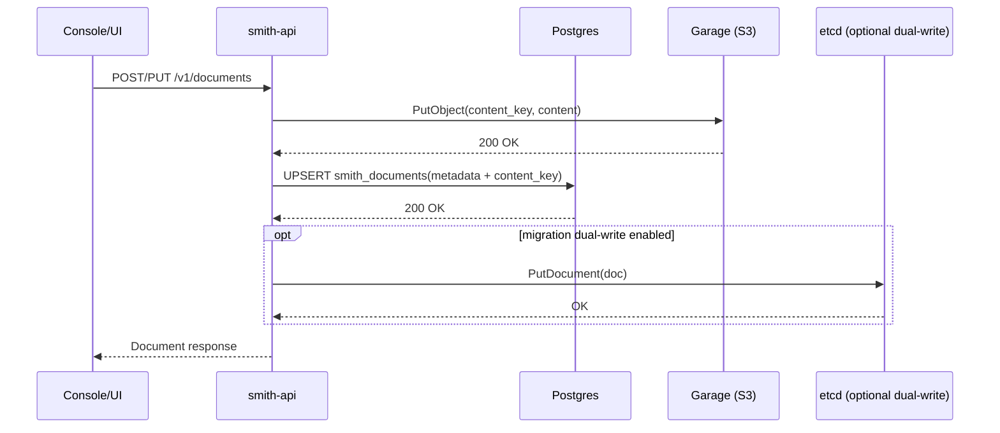
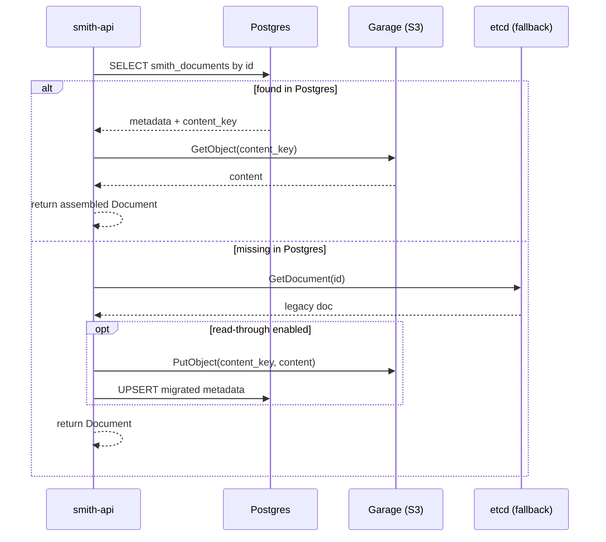
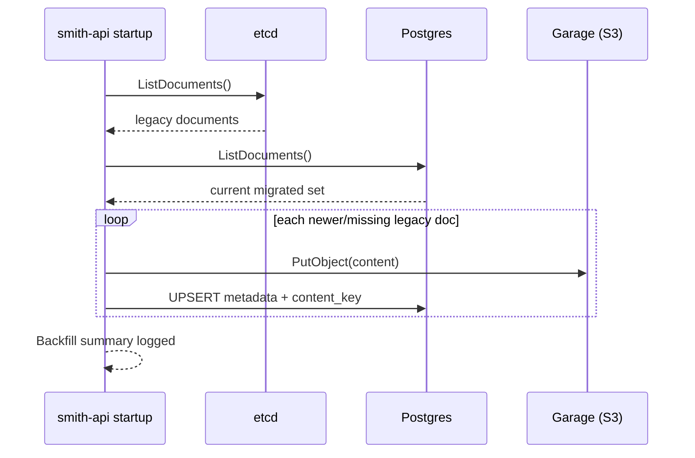

# Document Storage Architecture

This document describes the current storage architecture for `Document` records after the Postgres + Garage migration work.

## Storage Model

- `smith-api` remains the write/read API boundary for documents.
- Document metadata is stored in PostgreSQL table `smith_documents` when `SMITH_DOCUMENT_STORE_BACKEND=postgres-garage`.
- Document content blobs are stored in Garage (S3-compatible object storage).
- etcd remains authoritative for loop state, journal, locks, overrides, and audit records.
- etcd document storage is still supported as a compatibility backend (`SMITH_DOCUMENT_STORE_BACKEND=etcd`) and as migration fallback when configured.

## Component Updates

- `cmd/smith-api`
  - Document handlers (`/v1/documents`, `/v1/documents/stream`, `/v1/documents/{id}`) now use the document-store abstraction rather than directly calling etcd document methods.
  - Startup now supports migration orchestration (startup backfill + optional dual-write/read-through fallback behavior).
- `internal/source/docstore`
  - Added `PostgresGarageStore` for metadata/content split persistence.
  - Added `MigratingStore` wrapper for fallback merge, read-through, and dual-write behavior.
- `cmd/smith-chat` + `internal/chat/smithbridge`
  - Chat document context fetch now resolves document payloads via API (`/v1/documents/{id}`) instead of direct etcd document reads.

## ERD

## Write Sequence (Create / Update)

## Read Sequence (Read-Through)

## Startup Backfill Sequence

## Configuration

Primary knobs:

- `SMITH_DOCUMENT_STORE_BACKEND` = `etcd` or `postgres-garage`
- `SMITH_DOCUMENTS_POSTGRES_DSN`
- `SMITH_DOCUMENTS_GARAGE_ENDPOINT`
- `SMITH_DOCUMENTS_GARAGE_BUCKET`
- `SMITH_DOCUMENTS_GARAGE_ACCESS_KEY_ID`
- `SMITH_DOCUMENTS_GARAGE_SECRET_ACCESS_KEY`

Migration knobs:

- `SMITH_DOCUMENTS_MIGRATION_BACKFILL_ON_STARTUP`
- `SMITH_DOCUMENTS_MIGRATION_READ_THROUGH_ON_MISS`
- `SMITH_DOCUMENTS_MIGRATION_MERGE_LIST_FALLBACK`
- `SMITH_DOCUMENTS_MIGRATION_DUAL_WRITE_ETCD`

Helm values are under `api.documents.*`.

When in-chart dependencies are enabled, additional values live under `documentDependencies.*`.

Current Helm chart behavior:

- The chart wires API environment variables for Postgres + Garage connectivity.
- The chart can optionally provision single-node Postgres and Garage (`documentDependencies.postgres.enabled` and `documentDependencies.garage.enabled`).
- Credentials can be sourced from a Kubernetes Secret (`documentDependencies.credentials.*`) instead of plaintext values.
- Garage bootstrap can be automated via optional hook Job (`documentDependencies.garage.bootstrap.enabled`) that applies layout and provisions key/bucket permissions.
