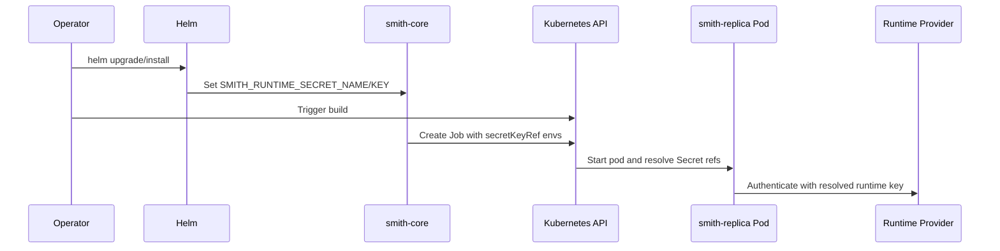
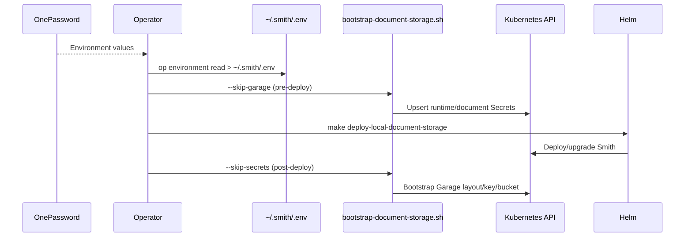
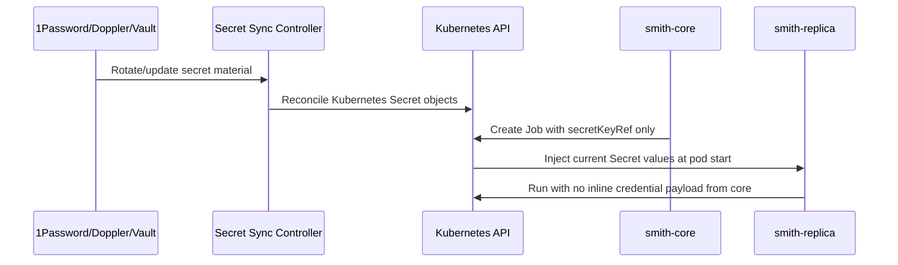

# Secret Reference System

This document captures the current Smith secret-reference model and the next improvements under consideration.

## Current State (as deployed today)

Smith uses Kubernetes Secret references as the primary credential path for runtime loops and document storage.

### 1) Runtime loop credentials (core -> replica)

Current contract:

- `smith-core` reads secret metadata from env:
  - `SMITH_RUNTIME_SECRET_NAME`
  - `SMITH_RUNTIME_CREDENTIALS_KEY`
  - `SMITH_GIT_PAT_SECRET_NAME`
  - `SMITH_GIT_PAT_SECRET_KEY`
- `smith-core` passes secret references to replica Job generation.
- Replica pods consume runtime credentials through `valueFrom.secretKeyRef` (`SMITH_RUNTIME_CREDENTIALS`, `OPENAI_API_KEY`) and git PAT (`SMITH_GIT_PAT`).

Important fallback behavior:

- Inline runtime fallback still exists for compatibility:
  - `SMITH_RUNTIME_CREDENTIALS` is used only when `SMITH_RUNTIME_SECRET_NAME` is unset.

Sequence (current runtime secret-ref path):

### 2) Document storage credentials (api + optional dependencies)

For `api.documents.backend=postgres-garage`:

- API can read document credentials from Secret via Helm wiring (`documentDependencies.credentials.*`).
- In in-chart dependency mode, Postgres/Garage use the same credential secret contract.

Default secret keys used by chart templates:

- `postgres_password`
- `postgres_dsn`
- `garage_access_key_id`
- `garage_secret_access_key`

### 3) Local operator source-of-truth flow

Current local workflow uses 1Password Environments + a private env file:

1. Export env values into `~/.smith/.env` (for example via `op environment read ...`).
2. Run `scripts/bootstrap-document-storage.sh` to upsert Kubernetes Secrets.
3. Deploy with `make deploy-local-document-storage` (ordered pre-secrets -> deploy -> post-bootstrap).

Sequence (current local ordered bootstrap flow):

## Secrets and Consumers

| Secret | Key(s) | Consumer | Purpose |
| --- | --- | --- | --- |
| `smith-runtime-external` (default local) | `git_pat`, `runtime_credentials` | core + replica Jobs | Git auth and runtime provider auth for loop execution |
| `smith-stage-documents` (default local/staging doc mode) | `postgres_password`, `postgres_dsn`, `garage_access_key_id`, `garage_secret_access_key` | api, documents-postgres, Garage bootstrap | Document metadata/content storage connectivity |

## Operational Notes

- Secret updates affect new pods/jobs; running pods keep env values loaded at pod start.
- `scripts/bootstrap-document-storage.sh` is idempotent for:
  - secret upserts,
  - Garage layout checks,
  - key/bucket verification and permission grants.
- `make deploy-local-document-storage` defaults to idempotent deploy behavior:
  - no forced rollout-id mutation,
  - no forced rollout restart.

## Known Gaps / Risks

- Inline runtime credential fallback still exists for backward compatibility.
- Local secret sync is still imperative (script-driven), not fully declarative controller-based sync.
- Secret presence/quality validation can still fail late (for example at loop runtime) if preflight checks are skipped.

## Possible Improvements (deferred decision)

These are candidate improvements; no final backend decision is required yet.

1. **Strict secret-ref mode by default**
   - Disable inline runtime fallback unless explicitly opted in for local-only emergency workflows.
   - Fail fast in core startup/scheduling when required secret refs are missing.

2. **Preflight validation gates**
   - Validate required secret keys and provider/model compatibility before creating loops.
   - Return clear API/UI errors instead of late replica failures.

3. **Declarative secret sync**
   - Use a controller/operator sync from external secret manager to Kubernetes Secrets.
   - Keep app contract unchanged (still secretRef-only in Kubernetes).

4. **External secret manager options**
   - Continue with 1Password Environments + sync controller.
   - Evaluate Doppler sync model for simpler developer UX.
   - Evaluate HashiCorp Vault for stronger policy/dynamic-secret posture.

5. **Credential lifecycle hardening**
   - Rotation runbooks with automated rollout triggers for affected components.
   - Alerting on replica auth failures that indicate stale/invalid secrets.

Sequence (proposed declarative sync model):

## Related Docs

- [Environment Variables (Important)](environment-variables.md)
- [Document Storage Bootstrap Script](document-storage-bootstrap-script.md)
- [Helm Upgrade/Rollback Runbook](helm-upgrade-rollback-runbook.md)
- [Deployment Recommendations](deployment-recommendations.md)
